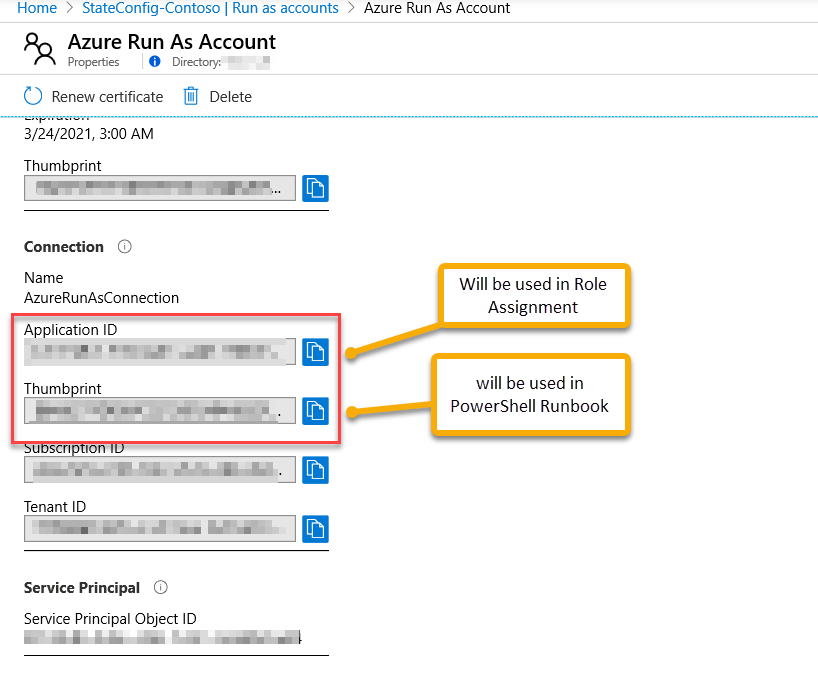

# Deploy With Azure Automation

Project to deploy software to Azure VMs using Azure Automation DSC and Azure Storage to host source files.

1. Create the following Prerequisites
    - Create Azure Automation Account
    - Create an Azure Storage Account File share to host msi/installation source files
1. Get the Storage Account Access Credentials
1. Add Credentials to Azure Automation Assets
1. Create Configuration scripts
    - Get credential for Azure Automation
    - use credential in related configs
1. Deploy config to node


# Create Azure Automation Account
- Create an Azure automation account
- Import following modules
    - Az.Accounts : Browse the gallery and add
    - Az.Automation: Browse the gallery and add
    - ServerApps: Add the zip file in the project modules diretory

- Get the Run As Credentials
    
- Set the Azure Run As Account to be a contributer


# Architecture Components

Below is a high level view of the solution


## CreateAzure Automation

We use Azure Automation to push configuration to VMs

### Highlevel Steps

1. Create DSC Config
1. Upload DSC config to Azure Automation

1. Ensure MsiSettings exits under variables. 
    - If MsiSettings is not available under variables not create a new one

    ```PowerShell
    Connect-AzAccount
    $MsiSettings = @(

    @{MsiFile = '7z1900-x64.msi'; ProductID = '23170F69-40C1-2702-1900-000001000000';  Name = '7-Zip 19.00 (x64 edition)'; Arguments = '/norestart'},
    @{MsiFile = 'googlechromestandaloneenterprise64.msi'; ProductID = '09D53CC6-0A7A-3BE2-B558-542159936402';  Name = 'Google Chrome'}


    )
    new-AZAutomationVariable -AutomationAccountName 'StateConfig-Contoso' -ResourceGroupName 'EastUS' -Name 'MsiSettings' -Value $MsiSettings -Encrypted $false
    ```
     - to update existing Msisettings edit the below and run
    ```PowerShell
    Connect-AzAccount
    $MsiSettings = @(

    @{MsiFile = '7z1900-x64.msi'; ProductID = '23170F69-40C1-2702-1900-000001000000';  Name = '7-Zip 19.00 (x64 edition)'; Arguments = '/norestart'},
    @{MsiFile = 'googlechromestandaloneenterprise64.msi'; ProductID = '09D53CC6-0A7A-3BE2-B558-542159936402';  Name = 'Google Chrome'}


    )
    Set-AZAutomationVariable -AutomationAccountName 'StateConfig-Contoso' -ResourceGroupName 'EastUS' -Name 'MsiSettings' -Value $MsiSettings -Encrypted $false
    ```
1. Connect the Node
1. Monitor Results in Azure Monitor


## Azure Storage Account
1. We need a general-purposev2 type Storage Account to host Installation Sources (msi). Sample Storage Account configuration is as follows.


1. Create an azure file share


1. Get the Storage Account Name and Keys
1. Add Keys to Azure Automation Credentials
1. Add Credentials to Azure Automation DSC Config


# Sample Codes

List default Resources available

```PowerShell
Get-DscResource -Module PSDesiredStateConfiguration
```

List Configurable Properties for a Resource

```PowerShell
Get-DscResource -Name WindowsFeature -Syntax 
  
WindowsFeature [String] #ResourceName
{
    Name = [string]
    [Credential = [PSCredential]]
    [DependsOn = [string[]]]
    [Ensure = [string]{ Absent | Present }]
    [IncludeAllSubFeature = [bool]]
    [LogPath = [string]]
    [PsDscRunAsCredential = [PSCredential]]
    [Source = [string]]
} 
```
Sample Windows Feature Config
 
```PowerShell
configuration TestConfig
{
    Node IsWebServer
    {
        WindowsFeature IIS
        {
            Ensure               = 'Present'
            Name                 = 'Web-Server'
            IncludeAllSubFeature = $true
        }
    }
 
    Node NotWebServer
    {
        WindowsFeature IIS
        {
            Ensure               = 'Absent'
            Name                 = 'Web-Server'
        }
    }
} 
```

To Use Azure Automation Credentials in a script;
To mount drive 


)

Use Azure Automation Credentials in DSC Config use the following sample. 

```PowerShell

Configuration CredentialSample
{
    Import-DscResource -ModuleName PSDesiredStateConfiguration
    $Cred = Get-AutomationPSCredential 'SomeCredentialAsset'

    Node $AllNodes.NodeName
    {
        File ExampleFile
        {
            SourcePath      = '\\Server\share\path\file.ext'
            DestinationPath = 'C:\destinationPath'
            Credential      = $Cred
        }
    }
}

```
Package Resource Syntax
```PowerShell
Package [string] #ResourceName
{
    Name = [string]
    Path = [string]
    ProductId = [string]
    [ Arguments = [string] ]
    [ Credential = [PSCredential] ]
    [ LogPath = [string] ]
    [ ReturnCode = [UInt32[]] ]
    [ DependsOn = [string[]] ]
    [ Ensure = [string] { Absent | Present }  ]
    [ PsDscRunAsCredential = [PSCredential] ]
}
```
To get the Storage Account Credentials (keys)

```PowerShell
$resourceGroupName = 'SystemCenter'
$storageAccountName = 'contosofileserver'
$fileShareName = 'Products'
$AccessKey = 'cMFf6HKrhrDdFRH+TKnOqDhz8atKEzt4iYFwmYzVfd0UhgAogc5AMH3mOgWM+K+GQdPQ7ujqyrtSP3x3Gip3nQ=='

$storageAccount = Get-AzStorageAccount -ResourceGroupName $resourceGroupName -Name $storageAccountName
$storageAccountKeys = Get-AzStorageAccountKey -ResourceGroupName $resourceGroupName -Name $storageAccountName

$password = ConvertTo-SecureString -String $storageAccountKeys[0].Value -AsPlainText -Force
$credential = New-Object System.Management.Automation.PSCredential -ArgumentList "AZURE\$($storageAccount.StorageAccountName)", $password
```

```PowerShell

$connectTestResult = Test-NetConnection -ComputerName azureautomationwithemre.file.core.windows.net -Port 445
if ($connectTestResult.TcpTestSucceeded) {
    # Save the password so the drive will persist on reboot
    cmd.exe /C "cmdkey /add:`"azureautomationwithemre.file.core.windows.net`" /user:`"Azure\azureautomationwithemre`" /pass:`"GYuI8CRDJCAnRrgmTqA1myfNNl0FsbbpBugrMCVug05nKkjGvvH+ddkvS7rAI0XzyjP6ui8EHxU24nvtge2jTQ==`""
    # Mount the drive
    New-PSDrive -Name Z -PSProvider FileSystem -Root "\\azureautomationwithemre.file.core.windows.net\installationsources"-Persist
} else {
    Write-Error -Message "Unable to reach the Azure storage account via port 445. Check to make sure your organization or ISP is not blocking port 445, or use Azure P2S VPN, Azure S2S VPN, or Express Route to tunnel SMB traffic over a different port."
}

```

Getting Credential Asset from Azure Automation Sample

```PowerShell
$myCredential = Get-AutomationPSCredential -Name 'MyCredential'
$userName = $myCredential.UserName
$securePassword = $myCredential.Password
$password = $myCredential.GetNetworkCredential().Password 
```

To connect a node in a workflow use the following cmdlet.

```PowerShell
Register-AzureRmAutomationDscNode
        -AzureVMName <String>
        [-NodeConfigurationName <String>]
        [-ConfigurationMode <String>]
        [-ConfigurationModeFrequencyMins <Int32>]
        [-RefreshFrequencyMins <Int32>]
        [-RebootNodeIfNeeded <Boolean>]
        [-ActionAfterReboot <String>]
        [-AllowModuleOverwrite <Boolean>]
        [-AzureVMResourceGroup <String>]
        [-AzureVMLocation <String>]
        [-ResourceGroupName] <String>
        [-AutomationAccountName] <String>
        [-DefaultProfile <IAzureContextContainer>]
        [<CommonParameters>]
```

Getting Varible in Azure Automation
```PowerShell
Get-AzAutomationVariable -ResourceGroupName 'EASTUS' -AutomationAccountName 'StateConfig-Contoso' -Name 'MsiSettings'
```


# Referneces
- [Azure Storage](https://docs.microsoft.com/en-us/azure/storage/common/storage-account-overview)
- [how to use files in Azure Storage File Server](https://docs.microsoft.com/en-us/azure/storage/files/storage-how-to-use-files-windows)
- [Azure Autamation State Configuration](https://docs.microsoft.com/en-us/azure/automation/automation-dsc-getting-started)
- [Azure Automation Credential](https://docs.microsoft.com/en-us/azure/automation/shared-resources/credentials)
- [Azure Automation Credential assets](https://docs.microsoft.com/en-us/azure/automation/automation-dsc-compile#credential-assets)
- [Azure Table Storage Powershell](https://docs.microsoft.com/en-us/azure/storage/tables/table-storage-how-to-use-powershell)
- [ComputerManagementDsc](https://github.com/dsccommunity/ComputerManagementDsc)
- [Authoring Powerhell Composite Resources](https://docs.microsoft.com/en-us/powershell/scripting/dsc/resources/authoringresourcecomposite?view=powershell-7)
- [Using DSC Composite Resources - Tutorial](http://duffney.io/UsingDscCompositeResources)
- [Connect to Azure using Azure Automation](https://docs.microsoft.com/en-us/azure/automation/troubleshoot/runbooks#resolution-13)

# Tools
- [FlowCharts](https://www.draw.io/)
- [MindMapping](https://www.mindmeister.com/)